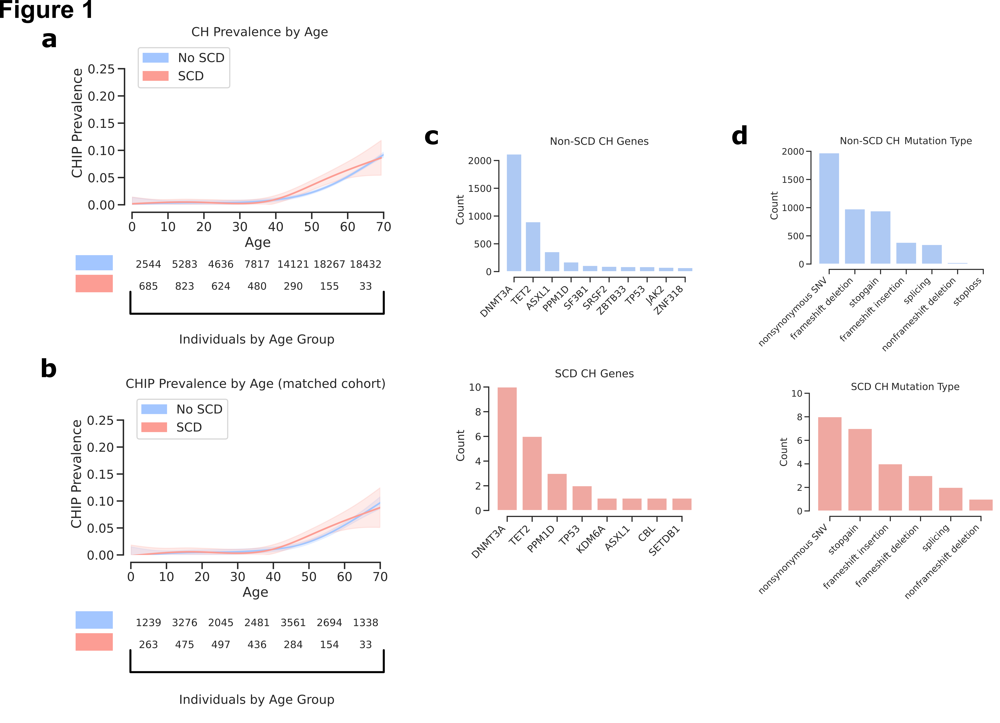

# Clonal Hematopoiesis in Sickle Cell Disease

## Abstract

**BACKGROUND.** Curative gene therapies for sickle cell disease (SCD) are currently undergoing clinical evaluation. The occurrence of myeloid malignancies in these trials has prompted safety concerns. Individuals with SCD are predisposed to myeloid malignancies, but the underlying causes remain undefined. Clonal hematopoiesis (CH) is a pre-malignant condition that also confers significant predisposition to myeloid cancers. While it has been speculated that CH may play a role in SCD-associated cancer predisposition, limited data addressing this issue have been reported.

**METHODS.** Here, we leveraged 74,190 whole genome sequences to robustly study CH in SCD. Somatic mutation calling methods were used to assess CH in all samples and comparisons between individuals with and without SCD were performed.

**RESULTS.** While we had sufficient power to detect a greater than 2-fold increased rate of CH, we found no detectable variation in rate or clone properties between individuals affected by SCD and controls. The rate of CH in individuals with SCD was unaltered by hydroxyurea use.

**CONCLUSIONS.** We did not observe an increased risk for acquiring detectable CH in SCD, at least as measured by whole genome sequencing. These results should help guide ongoing efforts and further studies that seek to better define the risk factors underlying myeloid malignancy predisposition in SCD and help ensure that curative therapies can be more safely applied.

  
 

## Citation 

[Liggett et al. JCI 2022](https://www.jci.org/articles/view/156060)  
[Liggett et al. medRxiv 2021](https://www.medrxiv.org/content/10.1101/2021.06.12.21258772v1)  

## Mutect2 Mutation Calling

Somatic CHIP mutations we called from exome sequencing data included 
